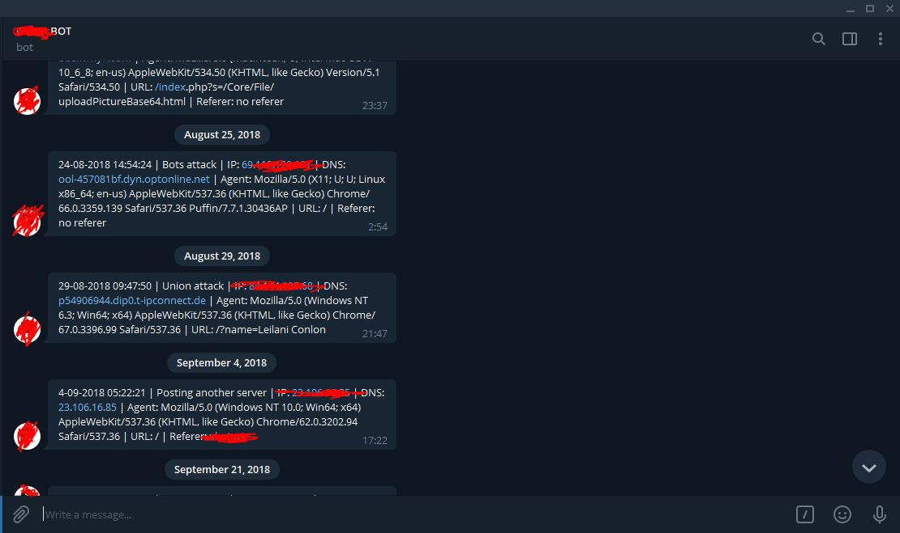

# SimpleWAF

Simple Web Application Firewall real time report using Telegram Bot API. A WAF or Web Application Firewall helps protect web applications by filtering and monitoring HTTP traffic between a web application and the Internet. It typically protects web applications from attacks such as cross-site forgery, cross-site-scripting (XSS), file inclusion, and SQL injection, among others. A WAF is a protocol layer 7 defense (in the OSI model), and is not designed to defend against all types of attacks. This method of attack mitigation is usually part of a suite of tools which together create a holistic defense against a range of attack vectors.

By deploying a WAF in front of a web application, a shield is placed between the web application and the Internet. While a proxy server protects a client machine’s identity by using an intermediary, a WAF is a type of reverse-proxy, protecting the server from exposure by having clients pass through the WAF before reaching the server.

### Donate
- If this project very help you to secure your web application and u want support me , you can give me a cup of coffee :)
- 

## Features
- Real time report using Telegram Bot API
- Protect Range IP Deny
- Protect From IP Spam
- Protect Request URL
- Protect Request Server
- Protect Santy
- Protect Bots
- Protect Request Method
- Protect DoS, Union SQL, Click Jacking, Cookies, and Upload

## Screenshot

## Disclaimer

***Note: modifications, changes, or alterations to this sourcecode is acceptable, however,any public releases utilizing this code must be approved by writen this application.***
